# Cloud Cover Index

CCI is a school project that computes the cloud cover index of any image of the sky using
a basic RGB-based cloud segmentation algorithm.

## How to use

#### Build at home

1. Download 1.15 Golang compiler. Instructions [here](https://golang.org/doc/install).
2. Build binary with `go build cmd/main.go -o cci`
3. (optionally) Run and build in the same command `go run cmd/main.go`

#### Instructions

Use built binary with the following flags
- **`-src`** path to the source image
- **`-mask`** path to the mask image
- **`-s`** if set, an output file with the segmentation results will be created
- **`-out`** path to the output file (will be created for you)

**Examples**

- Just output cloud cover index:

```sh
./cci -src myImage.jpg -mask myMask.png
```

- Output cloud cover image and segmentation file:

```sh
./cci -src myImage.jpg -mask myMask.png -s -out myOutputFile.png
```

## Results

| Source Image   |                Segmentation result           | CCI           |
| :-------------------------: | :-----------------------------: | :-----------: |
| 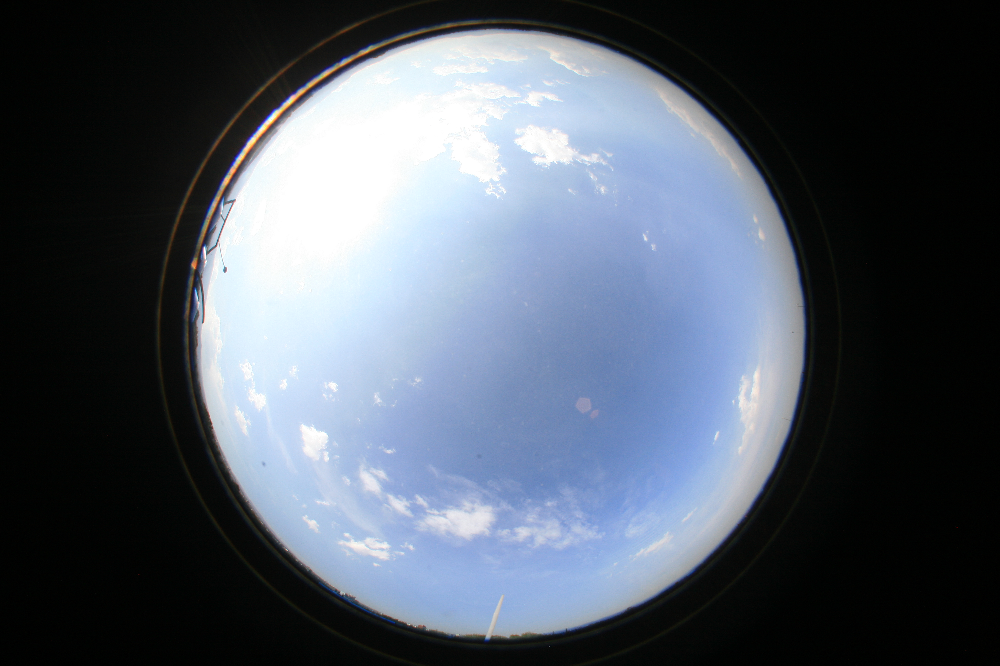 | 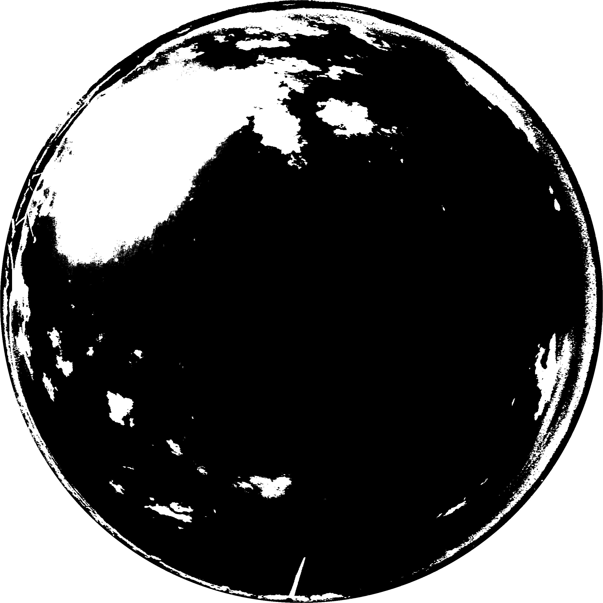 | 0.181054      |

*command*: **`./cci -src samples/360-1.jpg -mask samples/mask-1350-sq.png -s -out samples/360-1.png`**


| Source Image   |                Segmentation result           | CCI           |
| :-------------------------: | :-----------------------------: | :-----------: |
| 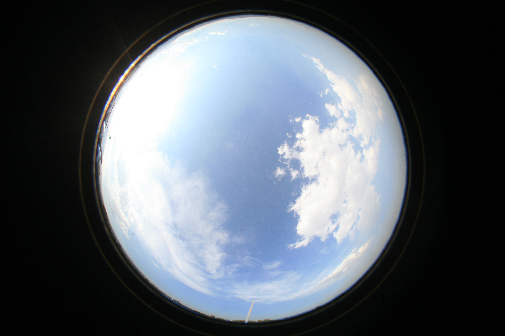 | 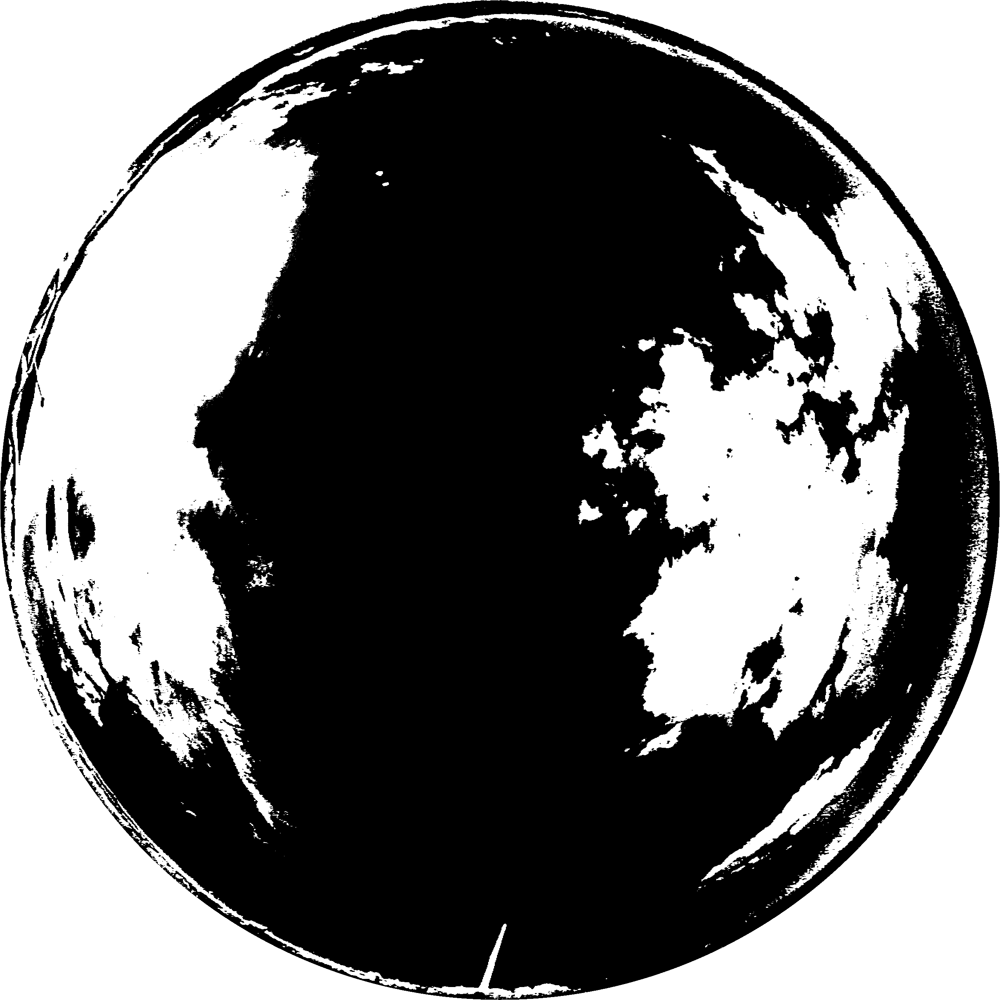 | 0.292510      |

*command*: **`./cci -src samples/360-2.jpg -mask samples/mask-1350-sq.png -s -out samples/360-2.png`**

| Source Image   |                Segmentation result           | CCI           |
| :-------------------------: | :-----------------------------: | :-----------: |
| 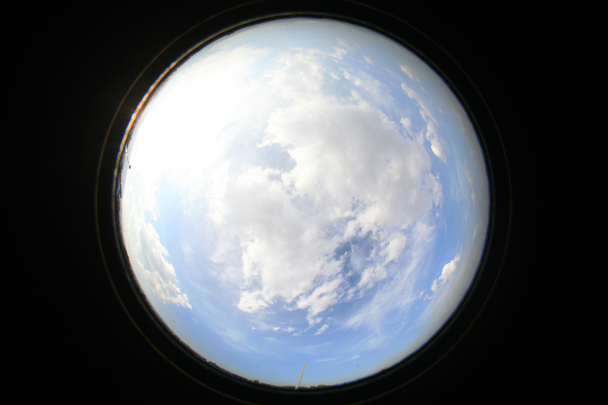 | 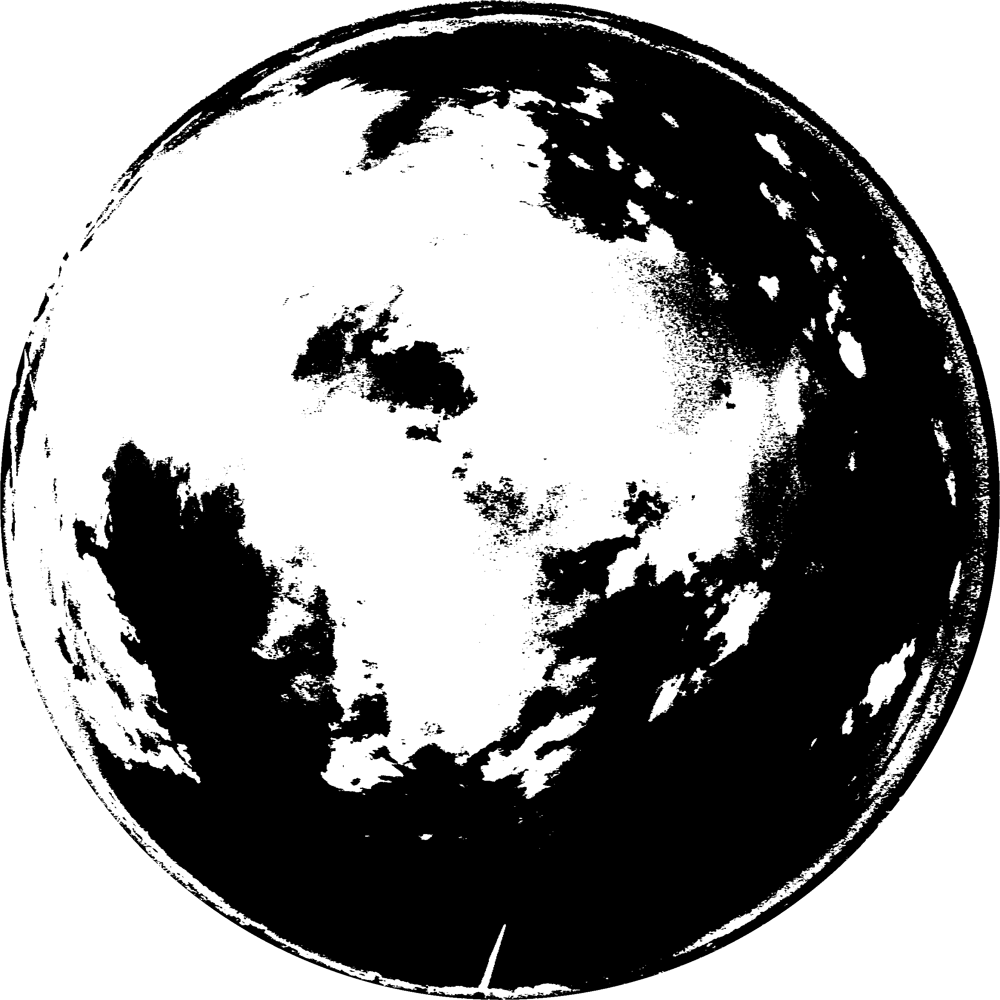 | 0.44803       |

*command*: **`./cci -src samples/360-3.jpg -mask samples/mask-1350-sq.png -s -out samples/360-3.png`**

| Source Image   |                Segmentation result           | CCI           |
| :-------------------------: | :-----------------------------: | :-----------: |
| 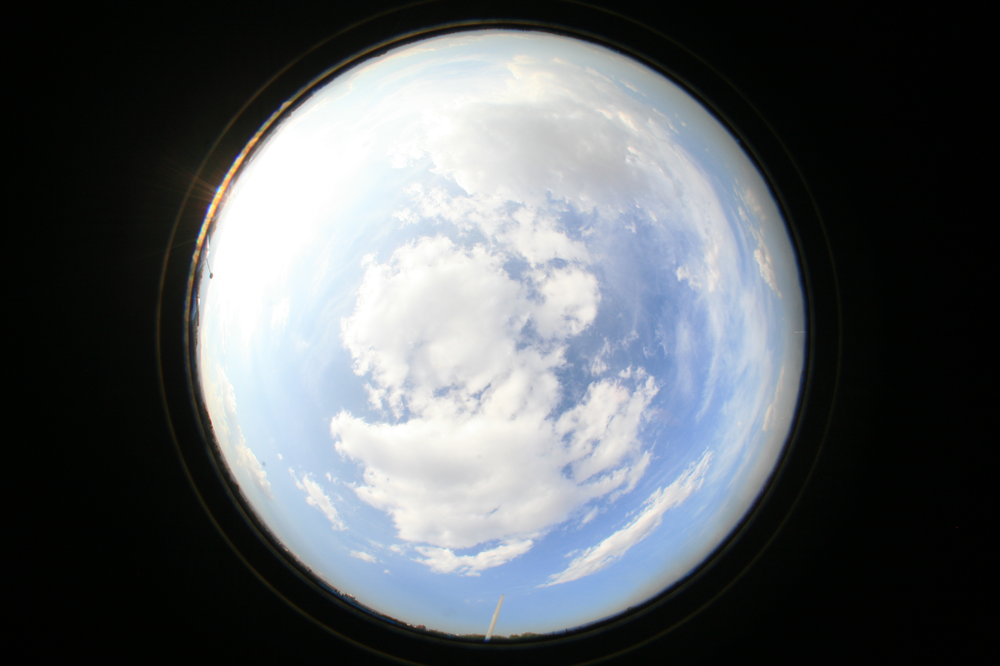 | 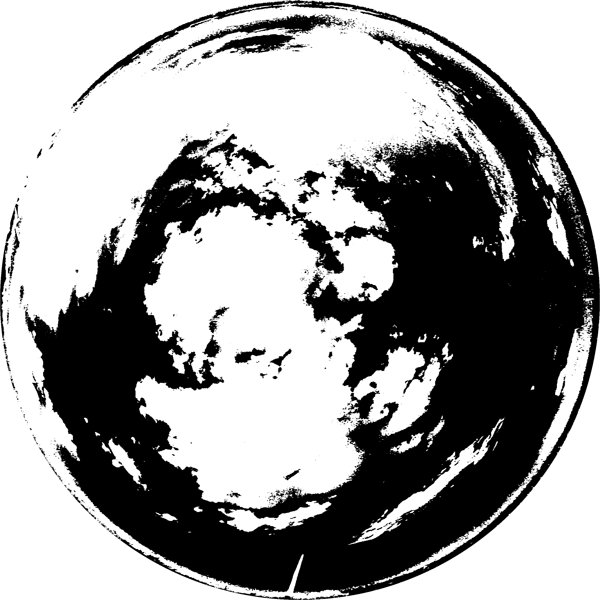 | 0.505722      |


*command*: **`./cci -src samples/360-4.jpg -mask samples/mask-1350-sq.png -s -out samples/360-4.png`**

| Source Image   |                Segmentation result           | CCI           |
| :-------------------------: | :-----------------------------: | :-----------: |
| 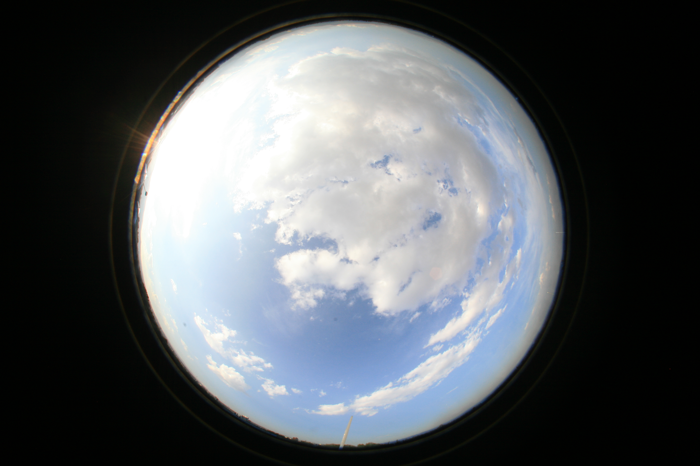 | 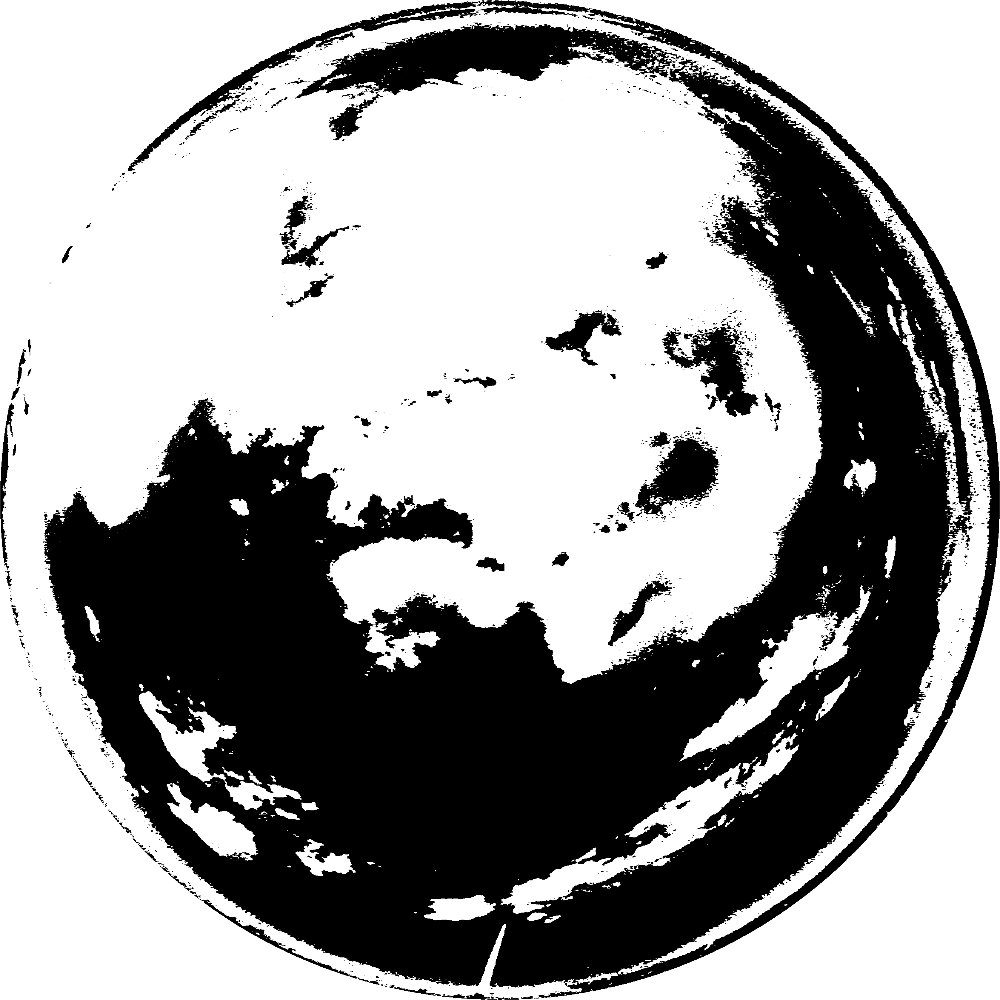 | 0.517248      |

*command*: **`./cci -src samples/360-5.jpg -mask samples/mask-1350-sq.png -s -out samples/360-5.png`**

| Source Image   |                Segmentation result           | CCI           |
| :-------------------------: | :-----------------------------: | :-----------: |
| 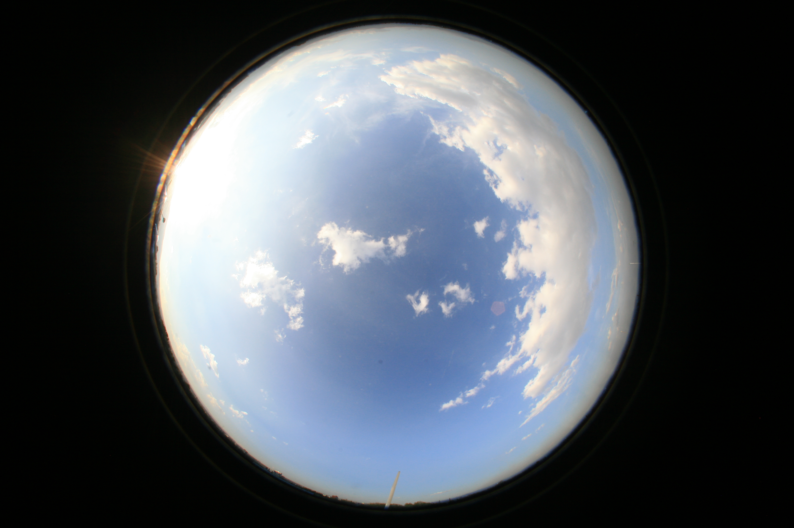 |  | 0.324765      |

*command*: **`./cci -src samples/360-6.jpg -mask samples/mask-1350-sq.png -s -out samples/360-6.png`**

## Package structure

## How to use


