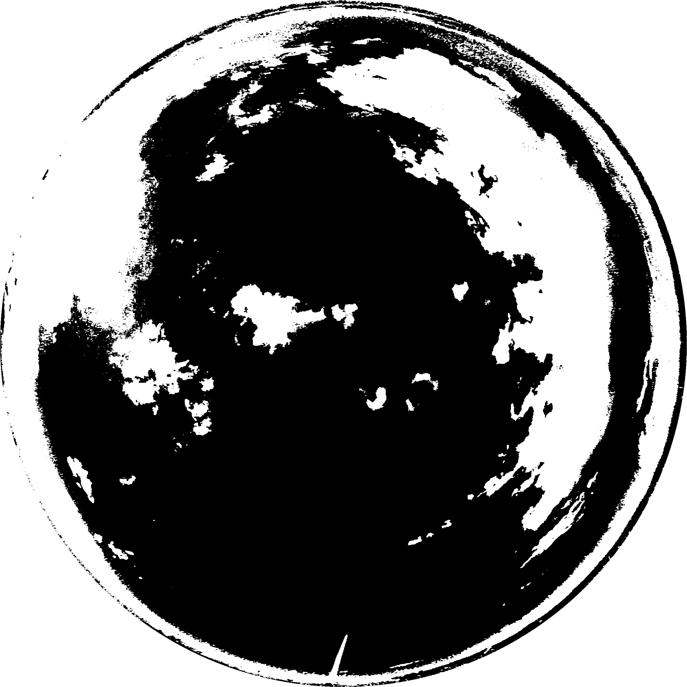

# Cloud Cover Index

CCI is a school project that computes the cloud cover index of any image of the sky using
a basic RGB-based cloud segmentation algorithm.

## Results

| Source Image   |                Segmentation result           | CCI           |
| :-------------------------: | :-----------------------------: | :-----------: |
|  |  | 0.181054      |
*command*: **`./cci -src samples/360-1.jpg -mask samples/mask-1350-sq.png -s -out samples/360-1.png`**

| Source Image   |                Segmentation result           | CCI           |
| :-------------------------: | :-----------------------------: | :-----------: |
|  |  | 0.292510      |
*command*: **`./cci -src samples/360-2.jpg -mask samples/mask-1350-sq.png -s -out samples/360-2.png`**

| Source Image   |                Segmentation result           | CCI           |
| :-------------------------: | :-----------------------------: | :-----------: |
|  |  | 0.44803       |
*command*: **`./cci -src samples/360-3.jpg -mask samples/mask-1350-sq.png -s -out samples/360-3.png`**

| Source Image   |                Segmentation result           | CCI           |
| :-------------------------: | :-----------------------------: | :-----------: |
|  |  | 0.505722      |
*command*: **`./cci -src samples/360-4.jpg -mask samples/mask-1350-sq.png -s -out samples/360-4.png`**

| Source Image   |                Segmentation result           | CCI           |
| :-------------------------: | :-----------------------------: | :-----------: |
|  |  | 0.517248      |
*command*: **`./cci -src samples/360-5.jpg -mask samples/mask-1350-sq.png -s -out samples/360-5.png`**

| Source Image   |                Segmentation result           | CCI           |
| :-------------------------: | :-----------------------------: | :-----------: |
|  |  | 0.324765      |
*command*: **`./cci -src samples/360-6.jpg -mask samples/mask-1350-sq.png -s -out samples/360-6.png`**

## Package structure

## How to use

